# notionwiki

A one-way bridge that pulls your Notion workspace into the immutable Raw Sources layer of an LLM Wiki, so an assistant can build and maintain a compounding knowledge base on top. Inspired by [LLM Wiki](llm_wiki.md).

Notion stays the source of truth — you author from anywhere. A scheduled job polls the workspace, converts pages to markdown, and files them as raw source material under `raw/notion/`. There is no write-back: no push, no conflict resolution, no file watcher.

## Install

```bash
npm install -g notionwiki
```

<sub>Also works with `pnpm add -g notionwiki` or `bun install -g notionwiki`.</sub>

The npm package is a thin wrapper: on first run it provisions a self-contained Python runtime (via [`uv`](https://docs.astral.sh/uv/) if present, otherwise your system Python ≥ 3.11) and installs the CLI into it. You get a global `notionwiki` command (alias `nw`) with no manual Python setup.

<details>
<summary>Prefer to install straight from Python?</summary>

```bash
uv tool install notionwiki      # or: pipx install notionwiki
```

Both give you the same global `notionwiki` / `nw` commands.
</details>

## Quickstart

```bash
notionwiki init     # interactive setup: Notion token, database scope, wiki path
notionwiki pull     # one-shot ingestion run
notionwiki status   # summary of the last run
```

Then schedule it so the wiki stays fresh:

```bash
notionwiki service install   # registers `pull` with your OS scheduler (~60s cadence)
```

## Commands

`notionwiki` (alias `nw`):

| Command | What it does |
| --- | --- |
| `init` | Interactive setup wizard (Notion token, database scope, wiki path). |
| `pull` | One-shot ingestion run. `--full` forces a full reconciliation sweep; `--json` for machine-readable output. |
| `status` | Summary of the last run (`--json`). |
| `open <query>` | Look up a raw page by filename, slug, or title substring. |
| `graph` | Generate `wiki/index.md` / `wiki/graph.json`. `--serve` hosts the force-directed graph UI at `127.0.0.1:7777` — pan/zoom/drag nodes, and click one to open a drawer with the rendered wiki page plus "Open in Notion" links back to its raw sources. |
| `lint` | Lint pass over the wiki pages. |
| `service install \| uninstall \| status` | Register/remove `pull` with the OS scheduler (Task Scheduler / launchd / systemd timer). |
| `daemon` | Optional long-lived loop instead of OS scheduling (`--interval-seconds`, `--serve-graph`). |

There is intentionally no `sync` or `push` — ingestion is one-directional.

## Architecture

Three layers, each with a clear owner and mutability:

| Layer | What it is | Owner | Mutability |
| --- | --- | --- | --- |
| **Notion** (source) | Where you keep and update content — pages, database rows — authored from anywhere | You | You edit freely in Notion |
| **Bridge daemon** | Periodically pulls Notion, converts to markdown, files into `raw/notion/`, records each pull in `daemon_log.md` | The bridge | — |
| **LLM Wiki** | `raw/` (one subfolder per feeder, immutable) + the agent-built `wiki/` and `outputs/` | Daemon writes `raw/notion/`; agent owns the rest | Agent-owned outside `raw/` |

Notion isn't the wiki — it feeds the wiki's raw-source layer. The wiki itself is built locally by an assistant reading those raw sources, following the [LLM Wiki](llm_wiki.md) pattern.

```mermaid
flowchart LR
    NOTION[("Notion API")]

    subgraph Ingest["🔄 notionwiki pull — scheduled"]
        POLL["Poll changed pages"]
        CONV["Convert blocks → markdown"]
        WRITE["Write: overwrite + archive"]
    end

    subgraph Wiki["📁 Wiki folder"]
        RAW["raw/notion/ · raw/... other feeders"]
        WK["wiki/ + outputs/ — agent-owned"]
    end

    subgraph Tooling["🕸️ notionwiki graph — on demand"]
        GEN["index.md / graph.json generator"]
        UI["Graph UI · localhost:7777"]
    end

    ASSIST(["🤖 Assistant"])

    NOTION --> POLL --> CONV --> WRITE --> RAW
    RAW -. read-only .-> ASSIST
    ASSIST -->|reads/writes| WK
    WK --> GEN --> UI

    classDef notion fill:#6366f1,stroke:#4338ca,stroke-width:2px,color:#fff
    classDef ingest fill:#14b8a6,stroke:#0f766e,stroke-width:2px,color:#fff
    classDef raw fill:#f59e0b,stroke:#b45309,stroke-width:2px,color:#fff
    classDef wiki fill:#f97316,stroke:#c2410c,stroke-width:2px,color:#fff
    classDef tooling fill:#0ea5e9,stroke:#0369a1,stroke-width:2px,color:#fff
    classDef assistant fill:#ec4899,stroke:#be185d,stroke-width:2px,color:#fff

    class NOTION notion
    class POLL,CONV,WRITE ingest
    class RAW raw
    class WK wiki
    class GEN,UI tooling
    class ASSIST assistant

    style Ingest fill:#ecfeff,stroke:#14b8a6,stroke-width:1.5px
    style Wiki fill:#fff7ed,stroke:#f97316,stroke-width:1.5px
    style Tooling fill:#f0f9ff,stroke:#0ea5e9,stroke-width:1.5px
```



Two independent concerns, deliberately separated:

1. **Ingestion** (`notionwiki pull`) owns exactly one direction — Notion → `raw/notion/` — and nothing else. It's a stateless, one-shot command: poll changed pages (incremental, by `last_edited_time`), convert blocks to markdown, overwrite-and-archive on write, log to `daemon_log.md`. A periodic full reconciliation sweep is the only place deletions are detected, since Search reports what changed, not what vanished. Its only persistent state is `state.db` (ingestion bookkeeping) and the ledger.
2. **Wiki tooling** (`notionwiki graph`) is wiki-layer only: it scans agent-built `wiki/*.md`, regenerates `wiki/index.md`/`wiki/graph.json`, and serves the graph UI. It has no dependency on Notion — `raw/` could be fed by other sources entirely and this would work unchanged.

### Local layout

```
<state dir>/                     ← ~/.notionwiki, $XDG_STATE_HOME, or %APPDATA%\notionwiki
├── config.toml                  ← wiki_root path, interval, database scope
├── state.db                     ← SQLite ingestion state
└── archive/                     ← replaced/removed raw versions, timestamped

<wiki_root>/                     ← chosen at `notionwiki init`
├── raw/                         ← Layer 1 — immutable source documents
│   ├── notion/                  ← the Notion feeder — bridge-owned, flat
│   │   ├── daemon_log.md        ← ingestion ledger
│   │   └── ...                  ← flat; Notion hierarchy lives in frontmatter
│   ├── articles/, papers/, ...  ← other feeders, dropped in by you or an agent
├── wiki/                        ← Layer 2 — agent-built
│   ├── index.md, graph.json     ← generated by `notionwiki graph`
│   ├── log.md, overview.md
│   ├── concepts/, entities/, sources/
├── outputs/                     ← generated reports / answers
└── CLAUDE.md / AGENTS.md        ← Layer 3 — schema config (agent-maintained)
```

### Key design decisions

- **Flat files + frontmatter breadcrumb.** `raw/notion/` has no nested folders; Notion's tree is recorded in frontmatter (`parent`, `breadcrumb`), so a Notion move/rename never churns the filesystem.
- **Filenames are frozen at first pull**, derived from the title and never renamed afterward — the stable identity is `notion_id` in frontmatter, not the filename. Title changes are logged as a `renamed` outcome instead of moving the file.
- **Databases → rows as pages.** Each database row is its own Notion page, so it becomes its own source `.md` file with `kind: database_row`.
- **Overwrite + archive on re-pull.** Updated pages get the current file archived to `archive/<timestamp>_<slug>.md` before being overwritten; deletions (found only by the full sweep) move the file to `archive/` rather than hard-deleting.
- **`content_hash` drives change detection**, computed over the converted markdown body only (never frontmatter, since `last_pulled` changes every run) — timestamps only gate whether a page's blocks get re-fetched.
- **Single-instance lock.** Every run takes a lock before touching `state.db`/`raw/*.md`, so an overlapping manual run or a slow run bumping into the next scheduled tick can't corrupt state.
- **Scheduled, not resident.** `notionwiki pull` is one-shot; `notionwiki service install` registers it with the OS scheduler (Task Scheduler / launchd / systemd timer, ~60s cadence). A long-lived `notionwiki daemon` mode exists only for sub-minute cadence or co-hosting the graph UI.
- **Raw-layer immutability is convention, not enforcement** — `CLAUDE.md`/`AGENTS.md` at the wiki root instructs agents never to edit `raw/`.
- **Two front doors, one CLI.** `uv tool install`/`pipx install` from PyPI, and the npm wrapper (`npm install -g notionwiki`) that provisions a managed Python venv and execs the same console script — the Node layer adds no Python behavior, only packaging.

## Configuration

Environment variables the npm wrapper understands:

| Variable | Effect |
| --- | --- |
| `NOTION_WIKI_HOME` | Where the managed Python runtime lives (default `~/.notionwiki`). |
| `NOTION_WIKI_PYTHON` | Path to an existing `notionwiki` executable; skips runtime provisioning entirely. |
| `NOTION_WIKI_SKIP_BOOTSTRAP` | Skip provisioning during `npm install` (it will run on first use instead). |

## Development

Work on the Python package directly with `uv`:

```bash
uv sync --extra graph --extra daemon --group dev
uv run pytest                 # full test suite (HTTP mocked via respx; no live Notion workspace needed)
uv run pytest tests/test_convert_blocks.py -q
uv run ruff check src tests
uv run notionwiki --help     # run the CLI in place
```

See [docs/design.md](docs/design.md) for the full design rationale, roadmap, and open questions, and [CLAUDE.md](CLAUDE.md) for implementation status and deviations from the design doc.
