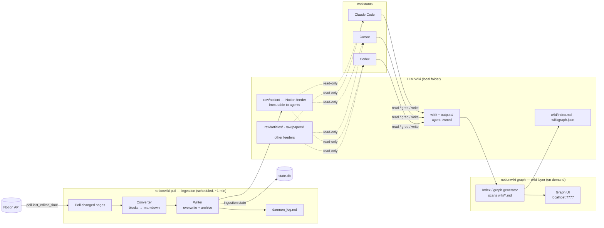

# notionwiki — Design Document

**Status:** Draft v2 (one-way redesign) · 2026-07-09
**Goal:** A **one-way ingestion bridge** that pulls a Notion workspace into the immutable Raw Sources layer of an LLM Wiki. Notion is where you author and update content from anywhere; a scheduled `notionwiki pull` periodically pulls it, converts it to markdown, and files it as raw source material. An assistant then builds and maintains the wiki layer on top — the "LLM Wiki" pattern (`../llm_wiki.md`), with Notion as the feeder for the raw layer.

> **v1 → v2 change.** The earlier design was a *bidirectional* mirror where Notion **was** the wiki (two-way sync, conflict resolution, block-level push, last-write-wins + backup). This redesign makes the bridge **pull-only**: Notion → markdown, one direction. That removes the entire write-back path — no push, no conflict resolution, no block-level patching, no `conflicts/`. The daemon becomes a simple *poll → convert → write → log* loop.

---

## 1. The three layers

Per `prompt.md`, the system is three layers, each with a clear owner and mutability:

| Layer | What it is | Owner | Mutability |
|---|---|---|---|
| **Notion** (source) | Where you keep and update data — articles, pages, database rows — authored from anywhere remotely | You | You edit freely in Notion |
| **Bridge Daemon** | Periodically pulls Notion, converts to markdown, files into its feeder folder `raw/notion/`, records each pull in `daemon_log.md` | The bridge | — |
| **LLM Wiki** | The raw layer `raw/` (one subfolder per feeder, immutable) + the agent-built `wiki/` and `outputs/` (summaries, entity/concept pages, syntheses, reports) | Daemon writes `raw/notion/`; agent owns the rest | See §4 |

The key reframe: **Notion is not the wiki — Notion feeds the wiki's raw-source layer.** The wiki itself is built locally by an assistant reading those raw sources, exactly as in the LLM Wiki pattern.

## 2. Decisions (settled)

| Question | Decision |
|---|---|
| Direction | **One-way pull only** (Notion → local markdown). No write-back to Notion. |
| Notion's role | **One feeder among many** — each feeder gets its own subfolder under `raw/`. The bridge owns `raw/notion/`; non-Notion raw material (clipped articles, PDFs, transcripts) lands in sibling folders (`raw/articles/`, `raw/papers/`, …) dropped in by you or an agent. |
| Re-pull on Notion edit/delete | **Overwrite + archive prior** — `raw/notion/` stays a clean mirror of current Notion state; each replaced/removed version is archived, never silently lost. |
| Hierarchy mapping | **Flat files + frontmatter breadcrumb** — no nested folders inside `raw/notion/`; Notion's tree is recorded in frontmatter, not the filesystem. |
| Databases | **Rows as pages** — each database row (itself a Notion page) becomes its own source `.md` file. |
| Raw-layer immutability | **Convention only** — `CLAUDE.md`/`AGENTS.md` instructs agents never to edit `raw/`; not daemon-enforced. |
| Logging | **Separate logs** — `daemon_log.md` (ingestion events, inside `raw/notion/`) is distinct from the wiki's `wiki/log.md` (agent operations). |
| Stack | **Python** (httpx, APScheduler; optional FastAPI for the graph UI). uv-managed, Python ≥3.11. |
| Agent interface | **Plain files + a small CLI** — assistants read the mirror directly; no MCP server. |

## 3. Architecture



**Two independent concerns, deliberately separated:**

1. **Ingestion** (`notionwiki pull`) owns exactly one direction — Notion → `raw/notion/` — and nothing else. It is a **stateless, one-shot command**: run it and it does one full pull/convert/write cycle and exits. It never reads agent edits, never touches the wiki pages, and knows nothing about the graph. Its only persistent state is `state.db` (ingestion bookkeeping: `notion_id`, hashes, pull timestamps) and the `daemon_log.md` ledger. It runs on a schedule (§10) — no long-lived process required.
2. **The wiki tooling** (`notionwiki graph`, §9) is a **wiki-layer** concern: it scans the agent-built `wiki/*.md`, generates `wiki/index.md`/`wiki/graph.json`, and serves the force-directed graph at localhost:7777. It has no dependency on Notion — you could feed `raw/` from other feeders only and the wiki tooling would work unchanged.

Assistants read `raw/` (by convention, never write it) and build/maintain the wiki layer beside it with their native file tools. Conventions load automatically via `AGENTS.md`/`CLAUDE.md` at the wiki root.

Because there is no write-back, there is **no watcher, no write queue, no conflict path** — the agent's edits to the wiki layer are simply local files ingestion never touches.

## 4. Local layout

The bridge keeps two things: a small **state directory** (OS default location) and the **wiki root** (location chosen by the user in `notionwiki init`, §8.1 — may sit anywhere, e.g. `~/.notionwiki` or inside a Dropbox/iCloud folder). `config.toml` records the chosen wiki path.

```
<state dir>/                     ← ~/.notionwiki, $XDG_STATE_HOME, or %APPDATA%\notionwiki
├── config.toml                  ← records wiki_root path, interval, database scope
├── state.db                     ← SQLite ingestion state
└── archive/                     ← replaced/removed raw versions, timestamped (§5.3)

<wiki_root>/                     ← user-chosen at init; the LLM Wiki root
├── raw/                         ← LAYER 1 — immutable source documents (§5)
│   ├── notion/                  ← the Notion feeder — bridge-owned, flat
│   │   ├── daemon_log.md        ← ingestion ledger (§6)
│   │   ├── bridge-design.md
│   │   ├── karpathy-llm-wiki.md
│   │   └── ...                  ← flat; Notion hierarchy lives in frontmatter
│   ├── articles/                ← other feeders — dropped in by you or an agent
│   ├── papers/
│   └── ...
├── wiki/                        ← LAYER 2 — LLM-generated markdown (agent-owned)
│   ├── index.md                 ← master catalog (generated by notionwiki graph, §9)
│   ├── graph.json               ← generated link graph (notionwiki graph, §9)
│   ├── log.md                   ← operation log (agent-owned narrative)
│   ├── overview.md              ← high-level synthesis
│   ├── concepts/                ← concept pages
│   ├── entities/                ← entity pages
│   └── sources/                 ← source summaries
├── outputs/                     ← generated reports / answers
└── CLAUDE.md / AGENTS.md        ← LAYER 3 — schema configuration (agent-maintained, §7)
```

- **`raw/` is one subfolder per feeder.** The bridge owns exactly `raw/notion/`; everything else under `raw/` belongs to other feeders and is never touched by ingestion.
- **`raw/notion/` is flat.** Every pulled Notion page — regular page, subpage, or database row — becomes one `.md` file directly under `raw/notion/`. Notion's nesting is preserved in frontmatter (`parent`, `breadcrumb`), not as folders, so a Notion move/rename never churns the filesystem.
- **Filenames are frozen at first pull.** Derived from the page title at that point (slugified, deduplicated with a short Notion-ID suffix on collision) and **never renamed afterward**, even if the Notion title changes later — the stable identity is `notion_id` in frontmatter, not the filename. This keeps `[[raw/notion/<slug>]]` citations from the wiki layer permanently stable; a title change is logged as a `renamed` outcome (§6) so the agent knows the display title moved, and the current title is always available in frontmatter. Cost: filenames can drift from the current title over time — acceptable since the raw layer's citable key is `notion_id`, not the name. (Resolves open question §14.4.)
- Reserved for the bridge: the whole of `raw/notion/` (including `daemon_log.md`). Generated by the wiki tooling: `wiki/index.md`, `wiki/graph.json`. All of `raw/` is read-only to agents (§7).
- **`archive/` lives in the state dir, not the wiki root** (deliberate — keeps the wiki clean). If the wiki root is synced via Dropbox/iCloud, note that `archive/` is **not** synced or backed up along with it; it's local-machine-only provenance, not a replicated store.

### File format (a pulled source)

```markdown
---
notion_id: 1a2b3c4d-....
notion_url: https://notion.so/...
source: notion                    # feeder tag; other raw sources use their own value
kind: page                        # page | database_row
database: Reading Notes           # present only for database rows
parent: 9f8e7d6c-....             # Notion parent id (breadcrumb reconstruction)
breadcrumb: ["Home", "Projects"]  # human-readable path in Notion
last_pulled: 2026-07-09T14:03:11Z
remote_edited_at: 2026-07-09T14:01:00Z
content_hash: sha256:...          # of normalized *body* only; drives change detection
---

# Bridge Design

Raw content converted from Notion. Agents read this; they never edit it.
```

All frontmatter here is **bridge-owned** — agents don't touch source files at all. The agent-owned LLM-Wiki metadata (`type`, `description`, `tags`, `sources:`) lives on the *wiki* pages the agent creates, which cite these raw files via `sources: ["[[raw/notion/bridge-design]]"]`.

`content_hash` is computed over the **converted markdown body only, never the frontmatter block** — hashing the whole file would make every run see a change (since `last_pulled` is refreshed every pull), producing an infinite overwrite+archive loop. "Normalized" means: LF line endings, trailing whitespace stripped per line, and a single trailing newline — applied before hashing so re-serializing identical content never produces a spurious diff.

## 5. Ingestion engine

### 5.1 Change detection (pull)

A pull runs in one of **two modes** — a cheap incremental poll on every tick, and a periodic full sweep that is the only place deletions can be detected (the Search API reports what *exists and changed*; a deleted page simply stops appearing, so no incremental poll can see it vanish):

**Incremental pull** (every tick, the default):

- Query the Notion **Search API**, sorted by `last_edited_time` **descending**, and **early-terminate** once results are older than the stored baseline minus an **overlap window** (a few minutes). The overlap window covers two realities: Notion Search is *eventually consistent* (results can lag edits), and `last_edited_time` has minute granularity — two edits in the same minute with a pull between them would otherwise leave the second edit invisible forever.
  > ⚠ **Search scope is a constraint, not an automatic guarantee.** The Search API returns everything shared with the integration, not just the wiki root — the two coincide only because §11 mandates sharing exactly the wiki root page and nothing else. If the user shares additional pages with the integration later, they silently enter scope. Worth stating plainly at share-time (in `init` and in `AGENTS.md`/`CLAUDE.md`): keep the integration shared with exactly the one root page.
  > ✅ **Page-scope filter (implemented).** `init` now lets the operator multi-select which shared pages to pull; the choice is stored as `[notion].root_page_ids` (a list — empty means "everything shared", the original behavior). At pull time `ingest/scope.py`'s `ScopeResolver` keeps only pages that are, or descend from, a selected page — walking each page's `parent_id` chain (fetching+caching ancestors as needed). This is the concrete form of §5.2's "page-tree walk from the root", realized as an ancestry filter over Search results rather than a top-down crawl, and it means extra pages shared with the integration no longer silently enter scope unless they sit under a selected root. (Deletion reconciliation still diffs against the full shared set; narrowing scope leaves previously-pulled files until they're deleted in Notion — a known limitation.)
- **Database rows are not discovered via Search** — rows can surface unreliably through the Search API, so they're always enumerated by direct database query (§5.2), never by search. Search covers regular pages/subpages only.
- **Block fetching is gated on the timestamp:** only pages whose `last_edited_time` is newer than the stored `remote_edited_at` (or inside the overlap window) get their block tree fetched, converted, and hashed. The `content_hash` comparison then decides whether anything actually changed and a write happens. Unchanged-timestamp pages cost one search-result row, not a block-tree fetch — this is what keeps a ~60 s cadence inside the API budget.

**Full reconciliation sweep** (every Nth run — default hourly — or on demand via `notionwiki pull --full`):

- Enumerate **all** in-scope pages (page-tree traversal from the wiki root + direct database queries for rows, §5.2) and diff the complete `notion_id` set against `state.db`. Pages present locally but absent remotely are the **deletions** → archived per §5.3. The sweep also self-heals anything an incremental poll missed (search-index lag beyond the overlap window, a page moved into scope).

**Both modes:**

- Runs on a **~60 s schedule** (§10); any run can also be invoked by hand. Each run reads its baseline from `state.db`, so cadence is a scheduling choice, not a code concern.
- Respect Notion's ~3 req/s average rate limit with a token-bucket limiter within a run and exponential backoff on 429. (An incremental pull is far under the budget; the full sweep is the expensive one, which is why it runs hourly, not every tick.)
- **Single-instance lock.** A manual `notionwiki pull` can overlap a scheduled tick, and a slow run (large workspace, 429 backoff) can easily exceed the 60 s cadence and overlap the *next* scheduled tick even without manual invocation. Two writers to `state.db` and the same `raw/*.md` files is a corruption path, so every run takes a single-instance lock first (a lock file beside `state.db`, or a SQLite `BEGIN EXCLUSIVE` transaction). A run that can't acquire it exits immediately and logs a `skipped | already running` ledger line (§6) rather than proceeding. This ships in **0.1** — it shapes `state.db`'s schema and the pull loop's skeleton from the start, not a 0.4 hardening add-on.

> ⚠ **Known constraint:** Notion's `last_edited_time` has **minute granularity**. The engine never trusts timestamps alone for "did it change" — timestamps only *gate the fetch* (with the overlap window as safety margin); `content_hash` decides. Timestamps only order confirmed changes.

Because the bridge is pull-only, this is the *entire* reconciliation model — there is no local-change detection and no merge.

### 5.2 Content conversion

Notion pages are block trees; the raw layer is markdown. The converter is bridge-owned (existing libraries like `notion2md` don't convert reliably enough):

- **Converted cleanly:** paragraphs, headings, bulleted/numbered/todo lists, code blocks, quotes, dividers, images (downloaded per below), bold/italic/strikethrough/inline code, links, page mentions.
- **Read-only islands** (synced blocks, embeds, columns, deeply nested toggles) render as a labeled fenced placeholder so the agent knows something exists but isn't fully captured:

  ````markdown
  ```notion-block id=abc123 type=embed
  🔗 Figma embed — view in Notion
  ```
  ````

  Since nothing is pushed back, placeholders are purely informational — there is no round-trip requirement to preserve.

**Assets.** Images (and other downloadable file blocks) are saved to `raw/notion/assets/` — a carved-out exception to "`raw/notion/` is flat," scoped as the one shared subfolder for binary attachments across all pages in the feeder. Filenames are the **content hash of the downloaded bytes** (e.g. `assets/sha256-<hash>.png`), which both dedupes identical images reused across pages and sidesteps churn from Notion's rotating asset URLs (open question §14.1 resolved this way); the markdown body references the asset by its relative path. Because **Notion's asset URLs are pre-signed S3 links that expire in about an hour**, the download must happen inside the same pull run that discovers the reference — never deferred to a later tick. When a page is archived (§5.3), its assets are left in place rather than deleted immediately: an asset is only orphaned (eligible for cleanup) once no `raw/notion/*.md` file references its hash, which a future `archive-prune`-style pass can check rather than tracking reference counts inline.

**Databases → rows as pages.** For each database in scope, the daemon enumerates its rows (each a Notion page), converts each row to its own `raw/notion/*.md` with `kind: database_row` and `database: <name>`, and includes the row's properties as a small frontmatter/property table plus the page body. A database with 40 rows yields 40 source files, each independently citable by the wiki layer.

### 5.3 Re-pull, overwrite + archive, deletions

On each tick, for every in-scope Notion page:

- **New** (unknown `notion_id`) → write a fresh `raw/notion/*.md`; log `new`.
- **Updated** (`content_hash` changed) → **archive the current file** to `archive/<timestamp>_<slug>.md` (with its frontmatter intact), then overwrite `raw/notion/*.md` with the new content; log `updated`.
- **Unchanged** → no write; not logged (or logged at debug level only).
- **Renamed only** (title changed but `content_hash` did not) → no re-write of the file (the filename stays frozen, §4); update the `title` recorded in frontmatter/`state.db` and log `renamed` so the agent notices the display title moved without a citation-breaking file move.
- **Deleted/trashed in Notion** (detected only by the full reconciliation sweep, §5.1) → move the local file to `archive/<timestamp>_<slug>.md` and remove it from `raw/notion/`; log `archived`. The bridge never hard-deletes.

`raw/notion/` therefore always reflects **current** Notion state, while `archive/` preserves every prior version for provenance and recovery.

**Settle window (archive churn control).** At a 60 s cadence, a page under active live editing for 30 minutes would otherwise produce ~30 archived versions of itself — one per tick that sees a hash change. To bound this, a page whose `last_edited_time` falls within the last **N minutes** (default a few minutes) is treated as still-settling: it's pulled and written once its timestamp stops advancing, rather than on every intermediate tick. This is simpler than coalescing after the fact and has the side benefit of reducing block-fetch traffic during a live edit. Coalescing archived versions after the fact (at most one per page per hour/day) or an `archive-prune` command remain options if churn is still a problem in practice, but the settle window is the first line of defense.

## 6. `daemon_log.md` — the ingestion ledger

Distinct from the wiki's `wiki/log.md` (a human-narrative timeline the agent maintains), `daemon_log.md` is a **machine-parseable, append-only ledger** the daemon owns. It lives inside the bridge's own feeder folder — `raw/notion/daemon_log.md` — keeping the wiki root clean and everything bridge-owned under one path. Following the `llm_wiki.md` tip about consistent prefixes, every line starts with `## [ISO-8601]` so simple tooling works without parsing prose:

```
## [2026-07-09T14:03:11Z] pull  | 1a2b3c4d | Bridge Design | updated | 12 blocks | archived→2026-07-09T14-03_bridge-design.md
## [2026-07-09T14:03:12Z] pull  | 5e6f7a8b | Reading Notes / Row 4 | new | 6 blocks
## [2026-07-09T14:03:12Z] pull  | 9c0d1e2f | Old Draft | archived | deleted in Notion
## [2026-07-09T14:03:12Z] pull  | 4d3c2b1a | Bridge Design (was: Design Doc) | renamed | slug unchanged
## [2026-07-09T14:03:13Z] error | 3a4b5c6d | Weekly Sync | convert | unsupported block: unsupported_type
## [2026-07-09T14:04:00Z] run   | -        | -             | skipped  | already running
```

- **Columns are `|`-delimited, not fixed-width** — they are shown padded above for readability, but a parser must split on `|` and trim, not assume column positions; long titles will drift alignment.
- **Title escaping:** a Notion page title can legally contain `|`. On write, literal `|` characters in `title`/`detail` fields are replaced with `/` (or percent-escaped as `%7C`) so the column count per line is never ambiguous to a naive `split("|")` parser.
- Actions: `pull` (outcome `new|updated|archived|unchanged|renamed`), `error` (outcome names the failing stage: `fetch|convert|write`), and `run` (outcome `skipped | already running` — emitted when the single-instance lock (§5.1) rejects a concurrent invocation; `notion_id`/`title` are `-` since no page-level work happened).
- Greppable: `grep "^## \[" daemon_log.md | tail -20` for recent activity; `grep "| error " daemon_log.md` for failures — the same data `notionwiki status` reads.
- **Rotation.** At up to 1,440 runs/day the ledger grows unboundedly and would eventually slow `notionwiki status` (which parses it) and inflate `raw/notion/`. The file rotates on a size cap (default a few MB) — the current file rolls to `daemon_log.<YYYY-MM>.md` and a fresh `daemon_log.md` starts; `status` reads the current file plus, if needed, the most recent rollover.

**Suggested improvement over a plain `log.md`:** because errors are first-class rows (not buried in prose), `notionwiki status` can surface "3 pages failed to convert since last clean run" deterministically, and a failed pull never blocks the rest of the batch.

## 7. Knowledge conventions (the LLM Wiki layer)

The bridge feeds the raw layer; an assistant builds the wiki. Conventions come from the LLM Wiki pattern (`../llm_wiki.md`), unchanged in spirit — **deterministic bookkeeping to scripts, judgment to the LLM.**

- **`CLAUDE.md` / `AGENTS.md`** (Layer 3, wiki root) — **the schema configuration itself**: page types (`concept`, `entity`, `source-summary`, `comparison`) mapped to the `wiki/` subfolders (`concepts/`, `entities/`, `sources/`), new-page-vs-edit-in-place rules, the compression rule (a wiki page larger than its source has negative value), the layout (`raw/` per-feeder, `wiki/`, `outputs/`), **the rule that all of `raw/` is read-only**, and the `notionwiki` CLI. **The agent maintains these files** — a classic LLM-Wiki act; the two are identical twins (Codex/Cursor auto-load `AGENTS.md`; Claude Code auto-loads `CLAUDE.md`), so an edit to one re-renders the other in the same operation (a lint check flags drift). `notionwiki init` seeds them (§8.1); after that the bridge never touches them — ingestion writes only `raw/notion/` (content + `daemon_log.md`) and `state.db` (§3).
- **`wiki/index.md`** — the master catalog of the *wiki* pages (grouped by `type`, one `description` line each), regenerated by `notionwiki graph` (§9) by scanning `wiki/` — **not** by the ingestion daemon. The agent's first read on any query: index → drill into ~10 pages → answer. Keeps retrieval cheap without embeddings at moderate scale (grep covers keyword search).
- **`wiki/graph.json`** — the wiki link graph as plain nodes/edges/backlink-counts, generated by the same `notionwiki graph` pass, for topology reasoning and the graph UI.

Both are **wiki-layer** artifacts derived from the agent's pages; the Notion ingestion daemon never generates or reads them.
- **`wiki/log.md`** — the agent's narrative wiki timeline (ingest/query/lint), separate from `daemon_log.md`.
- **`wiki/overview.md`** — the agent's high-level synthesis of the whole wiki; **`outputs/`** holds generated deliverables (reports, answers) that are products *of* the wiki, not part of it.

**Immutability of `raw/` is by convention:** `CLAUDE.md`/`AGENTS.md` state plainly that agents read `raw/` and cite it via `sources:` frontmatter but never edit it. Not enforced by the daemon (accepted for v1).

**Lint (agent-run).** Since the bridge no longer generates a sync-drift report, wiki health is the agent's `notionwiki lint`-style pass over the *wiki* layer: orphan pages, dangling `[[links]]`, pages missing `description`/`type`, compression violations, and `AGENTS.md`/`CLAUDE.md` drifted from each other (§7). Detection can be scripted; fixing is judgment.

## 8. Agent interface: files + CLI

No agent-facing server. The contract is the wiki directory plus a small CLI.

**Files**

| Agent need | How it's met |
|---|---|
| Read raw material | Read `raw/**/*.md` (read-only); cite via `sources: [[raw/notion/...]]` (or any feeder path) |
| Orient / retrieve | Read `wiki/index.md`, drill into ~10 wiki pages; grep/glob for keywords |
| Write / create | Ordinary file edits under the schema's rules — in `wiki/` (and `outputs/` for deliverables), never `raw/` |
| Ingestion history | `raw/notion/daemon_log.md` (what was pulled, when, errors) |
| Conventions | `AGENTS.md` / `CLAUDE.md` at the wiki root |

**CLI**

| Command | Purpose |
|---|---|
| `notionwiki init` | **Interactive setup wizard** (§8.1) — asks for the wiki location and everything else, scaffolds the layout (`raw/notion/`, `wiki/`, `outputs/`), seeds `CLAUDE.md`/`AGENTS.md`, stores the token, optionally installs the schedule |
| `notionwiki pull` | Force an immediate pull/convert/write cycle (the schedule handles it otherwise) — *ingestion* |
| `notionwiki status` | Ingestion health, last pull time, recent errors (reads `daemon_log.md`) — *ingestion* |
| `notionwiki graph` | Regenerate `wiki/index.md`/`wiki/graph.json` from the wiki pages and serve the graph UI at localhost:7777 — *wiki layer* (§9) |
| `notionwiki service install` | Register scheduled `notionwiki pull` with the OS scheduler (§10) — one command, OS detected automatically |
| `notionwiki open <page>` | Print the Notion URL / local path for a source — `<page>` is matched as a **filename/slug** first (exact, then substring), falling back to a case-insensitive **title substring** match against frontmatter if no filename matches; ambiguous matches list candidates instead of guessing |

Two intentional omissions: **no `notionwiki sync`/`push`** (the bridge never writes to Notion), and the graph/index generation lives under `notionwiki graph`, **not** the ingestion loop (§3).

### 8.1 Onboarding: interactive `notionwiki init`

The entire product is a **single cross-platform CLI** — the only thing a user installs, on Windows, macOS, or Linux alike. First run is an interactive wizard so nobody has to hand-write config; every prompt has a sensible default (shown in brackets) and `--yes`/flags allow a fully non-interactive run for scripting.

```
$ notionwiki init
notionwiki setup

1. Where should the wiki live?
   Wiki root  [~/.notionwiki]:            ← the location prompt; validated, created if absent
2. Paste your Notion internal integration token: ****   ← stored in the OS keychain (§11), not on disk
   ✓ token valid — connected as "Hema's workspace"
3. Which Notion page is the wiki root? (share it with the integration first)
   [1] Home   [2] Knowledge Base   [3] paste a page URL…   : 2
4. Also pull databases under it? [Y/n]: y
   Found 3 databases — pull all, or choose? [all/choose]: all
5. Pull interval in minutes [1]: 1
6. Install the background schedule now? [Y/n]: y
   ✓ Detected Windows — registered Task Scheduler task "notionwiki pull" (at log on, every 1 min)

✓ Wrote config to ~/.notionwiki/config.toml
✓ Scaffolded wiki at ~/.notionwiki (raw/notion/, wiki/, outputs/, CLAUDE.md/AGENTS.md)
Run `notionwiki pull` for a first sync, or point your assistant at ~/.notionwiki.
```

- **The wiki location prompt is step 1** and drives everything: the mirror, `state.db`, `archive/`, and the config all hang off it (or off an XDG/`%APPDATA%` state dir, with the *wiki* folder placed wherever the user chose).
- The wizard is OS-agnostic in every step except the final schedule install, where it detects the platform and calls the right mechanism (§10) — the user never picks Task Scheduler vs. launchd vs. systemd themselves.
- **The interval prompt is in minutes, not seconds.** Task Scheduler's repetition floor is one minute (§10); prompting in seconds and then silently rounding a user's "30" up to 60 would quietly disobey the input. Minutes with a floor of 1 keeps the prompt truthful; `notionwiki daemon` (§10) is the escape hatch for sub-minute cadence.
- Re-running `notionwiki init` is safe: it detects existing config and offers to reconfigure individual answers rather than clobbering.

### 8.2 CLI UX & branding

The CLI is the whole product, so its first impression is a Claude-Code-style welcome experience: a rounded, accented panel on launch rather than a bare help dump. Rendered with `rich` (cross-platform truecolor/box drawing; degrades to ASCII on legacy terminals).

**Names** (see also §12.1):

| Facet | Value | Notes |
|---|---|---|
| Command | `notionwiki` (alias `nw`) | canonical command; `nw` is a short alias for day-to-day use (`nw pull`, `nw status`) |
| PyPI package | `notionwiki` | globally unique; described as a tool *for* Notion, not named *as* Notion (trademark) |
| Python module | `notion_wiki` | importable package name (`src/notion_wiki/`, `python -m notion_wiki`) |
| Display name | **notionwiki** (stylized) | shown in the banner; configurable brand string in one place — swap freely without touching the command or package |

**Welcome panel** — printed on bare `notionwiki` (no args), `notionwiki init`, and `notionwiki --help`:

```
╭──────────────────────────────────────────────╮
│  ✻ Welcome to notionwiki                            │
│                                              │
│    Notion → LLM Wiki bridge · v0.1.0         │
│    Wiki    ~/.notionwiki                     │
│    Status  42 sources · last pull 2m ago     │
╰──────────────────────────────────────────────╯

 Try: notionwiki pull        sync from Notion now
      notionwiki graph       open the wiki map at localhost:7777
      notionwiki status      ingestion health
```

- The panel reads live state (wiki path, source count, last-pull age from `state.db`/`daemon_log.md`) so launch doubles as an at-a-glance dashboard — like Claude Code showing the cwd and context.
- A single accent color themes the panel, the `✻` mark, and section headings; everything else stays default-terminal so it works in light and dark.

**Banner suppression rules** (non-negotiable — the tool runs unattended):

- **Show** the banner on: bare `notionwiki`, `notionwiki init`, `notionwiki --help`, other human-facing interactive commands.
- **Suppress** it on: scheduled/unattended runs, any `--json` output, `--quiet`, and whenever stdout is **not a TTY** (auto-detected — piped or redirected output is always clean). Scheduled `notionwiki pull` therefore logs plain machine-parseable lines, never art.

This keeps the delight for humans and the cleanliness for machines; `typer` + `rich` handle the TTY check and theming in one place.

## 9. Wiki tooling: index + graph UI (`notionwiki graph`)

This is a **wiki-layer** concern, fully decoupled from Notion ingestion (§3). `notionwiki graph`:

1. Scans the agent-built `wiki/**/*.md` (excluding the generated `index.md`/`graph.json` themselves), parsing `[[links]]` and frontmatter (`type`, `description`).
2. Regenerates `wiki/index.md` (catalog) and `wiki/graph.json` (nodes/edges/backlink counts).
3. Serves `http://localhost:7777/graph` — FastAPI + a vendored force-directed library (no CDN, works offline), a *read-only* view sized by backlink count and colored by section/tag. Bound to `127.0.0.1` only.

It has **no dependency on Notion, `state.db`, or the ingestion daemon** — it works purely off the local wiki files, so it functions identically for non-Notion sources. It can run on demand, or as a long-lived server that regenerates on a timer or when the wiki files change. Optional and can ship after the ingestion path is solid.

## 10. Scheduling ingestion (Windows / macOS / Linux)

Ingestion is one-shot (`notionwiki pull`, §3), so the **primary model is a scheduled run** — no persistent process. `notionwiki service install|uninstall|status` registers a repeating schedule per OS:

| OS | Mechanism |
|---|---|
| **Windows** | **Task Scheduler** task, trigger *At log on* + *Repeat every 1 minute*, action `notionwiki pull`. No admin, no service, nothing resident between runs. |
| macOS | **launchd** user LaunchAgent with `StartInterval` (seconds) running `notionwiki pull` |
| Linux | **systemd user timer** (`notionwiki.timer` → `notionwiki.service` `Type=oneshot`) |

Each run reads its baseline from `state.db` and exits, so this is **crash-resilient by construction** — a killed or errored run simply leaves the next scheduled run to catch up; there is nothing to keep alive or restart. Interval is configurable in `config.toml` (default 60 s; Task Scheduler's floor is ~1 min).

**Optional long-lived mode.** `notionwiki daemon` runs the same pull loop in a single resident process (APScheduler timer), for two cases only: (a) sub-minute cadence below the scheduler's floor, or (b) co-hosting the `notionwiki graph` UI in one always-on process. It is strictly an alternative to the scheduled model, not required — the default install uses the scheduler above.

## 11. Security

- Notion **internal integration token**, stored in the OS keychain via `keyring` (env-var override for headless setups); never in `config.toml`.
- The integration is shared **only with the wiki root page** — Notion's permission model enforces the pull scope. (This is a share-time discipline the user must maintain, not something the API scopes automatically — see the Search-scope caveat in §5.1.)
- **Headless Linux.** `keyring`'s Secret Service backend needs a running keyring daemon (typically only present in a logged-in desktop session), which a headless box running a systemd user timer usually lacks. `notionwiki service install` on Linux **detects a missing Secret Service** at install time and steers the user to the `NOTION_WIKI_TOKEN` env-var override instead of failing opaquely on first scheduled run — a systemd user timer on a headless server is a mainstream target, not an edge case.
- The only HTTP surface is the optional graph UI, bound to localhost.

## 12. Project structure & tooling

```
notionwiki/
├── pyproject.toml              # uv-managed; Python ≥3.11
├── src/notion_wiki/
│   ├── cli.py                  # notionwiki init | pull | status | graph | service | open ...
│   ├── notion/                 # API client (httpx), rate limiter, models
│   ├── convert/                # blocks → markdown, database rows → pages
│   ├── ingest/                 # one-shot pull: poller, change detection, overwrite+archive writer
│   ├── schedule/               # notionwiki service install/uninstall (Task Scheduler / launchd / systemd)
│   ├── daemon.py               # OPTIONAL long-lived pull loop (§10); not the default
│   ├── store/                  # SQLite state, source file I/O, archive
│   └── graph/                  # wiki-layer: wiki/index.md + wiki/graph.json generator + FastAPI graph UI
└── tests/                      # pytest; block→markdown conversion is the critical suite
```

Key dependencies: `httpx`, `keyring`, `pyyaml`, `typer`, `rich` (welcome panel + themed output, §8.2); `fastapi`+`uvicorn` only for `notionwiki graph`; `apscheduler` only for the optional `notionwiki daemon` long-lived mode (the default scheduled model uses the OS scheduler, no library). Tooling: `uv`, `ruff`, `pytest`. Note the dropped v1 dependency on `watchdog` — there is no file watcher.

### 12.1 Distribution — one CLI, any OS

The deliverable is a **single installable CLI** that behaves identically on Windows, macOS, and Linux; nothing else is required to replicate the setup on a fresh workstation.

- Published to PyPI as `notionwiki`, exposing two console-script entry points — `notionwiki` and the short alias `nw` (both defined in `pyproject.toml [project.scripts]`, pointing at the same `notion_wiki.cli:app`).
- Install with `uv tool install notionwiki` or `pipx install notionwiki` — both give an isolated, on-`PATH` `notionwiki` (and `nw`) on every OS. Only prerequisite: Python ≥3.11.
- **npm wrapper (primary advertised install).** The repo also ships as an npm package so `npm install -g notionwiki` works for the Node-native audience. The wrapper (`package.json`, `bin/notionwiki.js`, `scripts/bootstrap.js`, `scripts/postinstall.js`) bundles the Python source and, on install/first run, provisions a managed venv under `~/.notionwiki` (via `uv` when present, else system `python -m venv`), installs the bundled package into it, and execs the Python console script with args passed straight through. The `bin` shim backs both `notionwiki` and `nw`. Env knobs: `NOTION_WIKI_HOME` (runtime location), `NOTION_WIKI_PYTHON` (bring-your-own executable, skip provisioning), `NOTION_WIKI_SKIP_BOOTSTRAP` (defer provisioning to first run). Postinstall failures are non-fatal — the shim retries on first invocation with a clear error.
- Everything is pure Python with cross-platform libraries (`httpx`, `keyring`, `typer`); no OS-specific build step. The *only* platform-aware code is `notionwiki service install` (§10), which is auto-detected — the user never sees the difference.
- After install, the entire lifecycle is CLI: `notionwiki init` (interactive, §8.1) → `notionwiki pull` / scheduled → `notionwiki graph`. No config files to edit by hand, no manual scheduler setup.

## 13. Roadmap

| Phase | Deliverable | Proves |
|---|---|---|
| **0.1** | `notionwiki init` + one-way pull of Notion pages/subpages → flat `raw/notion/*.md` + `daemon_log.md`; **incremental/full-sweep split** (§5.1) and the **single-instance lock** (§5.1) built into `state.db`'s schema and the pull loop from the start, not retrofitted | Auth, traversal, block→markdown conversion, a pull loop safe to run on a schedule |
| **0.2** | Database rows → source pages; overwrite + archive on re-pull; deletion → archive (full reconciliation sweep); settle window (§5.3) | Full raw-layer fidelity to current Notion state |
| **0.3** | `init` scaffolds `raw/`/`wiki/`/`outputs/` + seeds `CLAUDE.md`/`AGENTS.md` (agent maintains them thereafter, §7); `wiki/index.md`; assistants pointed at the folder | The agent-builds-the-wiki experience |
| **0.4** | `notionwiki service install` (scheduled `notionwiki pull`) on all three OSes; `notionwiki status`; hardening, backoff | Hands-off scheduled ingestion |
| **0.5** | `notionwiki graph`: `wiki/index.md`/`wiki/graph.json` generation + graph UI; agent-run lint over the wiki layer | The visible graph + wiki health |
| v2 ideas | Webhook-mode pulls via tunnel (near-instant), embeddings/hybrid search, daemon-enforced `raw/` immutability, **optional write-back** if bidirectionality is ever wanted again | — |

## 14. Open questions (non-blocking)

1. ~~**Attachment churn**~~ ✅ Resolved — content-hash-named assets under `raw/notion/assets/` (§5.2) dedupe automatically and never need re-downloading for unchanged content.
2. **Database scope selection** — which databases to pull (all shared, or an allowlist in `config.toml`)? Large databases could flood `raw/notion/`; consider a per-database row cap or filter.
3. **Search at scale** — agent grep + `wiki/index.md` should carry a personal wiki far; revisit hybrid search (BM25 + embeddings) if it outgrows that.
4. ~~**Slug stability**~~ ✅ Resolved — filenames are frozen at first pull and never renamed; `notion_id` is the stable key, renames are logged as a `renamed` outcome instead of moving the file (§4, §5.3).
