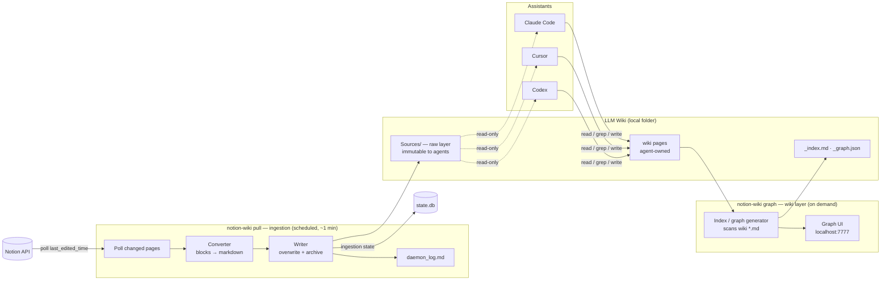

# notion-wiki — Design Document

**Status:** Draft v2 (one-way redesign) · 2026-07-09
**Goal:** A **one-way ingestion bridge** that pulls a Notion workspace into the immutable Raw Sources layer of an LLM Wiki. Notion is where you author and update content from anywhere; a scheduled `notion-wiki pull` periodically pulls it, converts it to markdown, and files it as raw source material. An assistant then builds and maintains the wiki layer on top — the "LLM Wiki" pattern (`../llm_wiki.md`), with Notion as the feeder for the raw layer.

> **v1 → v2 change.** The earlier design was a *bidirectional* mirror where Notion **was** the wiki (two-way sync, conflict resolution, block-level push, last-write-wins + backup). This redesign makes the bridge **pull-only**: Notion → markdown, one direction. That removes the entire write-back path — no push, no conflict resolution, no block-level patching, no `conflicts/`. The daemon becomes a simple *poll → convert → write → log* loop.

---

## 1. The three layers

Per `prompt.md`, the system is three layers, each with a clear owner and mutability:

| Layer | What it is | Owner | Mutability |
|---|---|---|---|
| **Notion** (source) | Where you keep and update data — articles, pages, database rows — authored from anywhere remotely | You | You edit freely in Notion |
| **Bridge Daemon** | Periodically pulls Notion, converts to markdown, files into the Raw Sources layer, records each pull in `daemon_log.md` | The bridge | — |
| **LLM Wiki** | The Raw Sources folder (Notion-fed, immutable) + the agent-built wiki (summaries, entity/concept pages, syntheses) | Daemon writes `Sources/`; agent owns the rest | See §4 |

The key reframe: **Notion is not the wiki — Notion feeds the wiki's raw-source layer.** The wiki itself is built locally by an assistant reading those raw sources, exactly as in the LLM Wiki pattern.

## 2. Decisions (settled)

| Question | Decision |
|---|---|
| Direction | **One-way pull only** (Notion → local markdown). No write-back to Notion. |
| Notion's role | **One feeder among many** — `Sources/` also accepts non-Notion raw material (clipped articles, PDFs, transcripts) dropped in by you or an agent. |
| Re-pull on Notion edit/delete | **Overwrite + archive prior** — `Sources/` stays a clean mirror of current Notion state; each replaced/removed version is archived, never silently lost. |
| Hierarchy mapping | **Flat files + frontmatter breadcrumb** — no nested folders; Notion's tree is recorded in frontmatter, not the filesystem. |
| Databases | **Rows as pages** — each database row (itself a Notion page) becomes its own source `.md` file. |
| Raw-layer immutability | **Convention only** — `CLAUDE.md`/`AGENTS.md` instructs agents never to edit `Sources/`; not daemon-enforced. |
| Logging | **Separate logs** — `daemon_log.md` (ingestion events) is distinct from the wiki's `_log.md` (agent operations). |
| Stack | **Python** (httpx, APScheduler; optional FastAPI for the graph UI). uv-managed, Python ≥3.11. |
| Agent interface | **Plain files + a small CLI** — assistants read the mirror directly; no MCP server. |

## 3. Architecture



**Two independent concerns, deliberately separated:**

1. **Ingestion** (`notion-wiki pull`) owns exactly one direction — Notion → `Sources/` — and nothing else. It is a **stateless, one-shot command**: run it and it does one full pull/convert/write cycle and exits. It never reads agent edits, never touches the wiki pages, and knows nothing about the graph. Its only persistent state is `state.db` (ingestion bookkeeping: `notion_id`, hashes, pull timestamps) and the `daemon_log.md` ledger. It runs on a schedule (§10) — no long-lived process required.
2. **The wiki tooling** (`notion-wiki graph`, §9) is a **wiki-layer** concern: it scans the agent-built wiki `*.md`, generates `_index.md`/`_graph.json`, and serves the force-directed graph at localhost:7777. It has no dependency on Notion — you could feed `Sources/` from something other than Notion and the wiki tooling would work unchanged.

Assistants read `Sources/` (by convention, never write it) and build/maintain the wiki layer beside it with their native file tools. Conventions load automatically via `AGENTS.md`/`CLAUDE.md` at the wiki root.

Because there is no write-back, there is **no watcher, no write queue, no conflict path** — the agent's edits to the wiki layer are simply local files ingestion never touches.

## 4. Local layout

The bridge keeps two things: a small **state directory** (OS default location) and the **wiki root** (location chosen by the user in `notion-wiki init`, §8.1 — may sit anywhere, e.g. `~/notion-wiki` or inside a Dropbox/iCloud folder). `config.toml` records the chosen wiki path.

```
<state dir>/                     ← ~/.notion-wiki, $XDG_STATE_HOME, or %APPDATA%\notion-wiki
├── config.toml                  ← records wiki_root path, interval, database scope
├── state.db                     ← SQLite ingestion state
└── archive/                     ← replaced/removed raw versions, timestamped (§5.3)

<wiki_root>/                     ← user-chosen at init; the LLM Wiki root
├── _schema.md                   ← conventions page (rendered to AGENTS.md/CLAUDE.md, §7)
├── AGENTS.md / CLAUDE.md        ← generated from _schema.md; auto-loaded by assistants
├── _index.md                    ← generated catalog of wiki pages (notion-wiki graph, §7)
├── _graph.json                  ← generated link graph (notion-wiki graph, §9)
├── daemon_log.md                ← ingestion ledger (ingestion, §6)
├── _log.md                      ← wiki operations timeline (agent-owned narrative)
├── Sources/                     ← RAW LAYER — Notion-fed, immutable to agents (§5)
│   ├── bridge-design.md
│   ├── karpathy-llm-wiki.md
│   └── ...                      ← flat; hierarchy lives in frontmatter
├── Home.md                      ← agent-built wiki pages
├── Concepts/
└── ...
```

- **`Sources/` is flat.** Every pulled Notion page — regular page, subpage, or database row — becomes one `.md` file directly under `Sources/`. Notion's nesting is preserved in frontmatter (`parent`, `breadcrumb`), not as folders, so a Notion move/rename never churns the filesystem.
- **Filenames** come from page titles (slugified, deduplicated with a short Notion-ID suffix on collision). The stable identity is `notion_id` in frontmatter, not the filename.
- Names starting with `_` and the `daemon_log.md` file are reserved for the bridge. The `Sources/` folder is reserved for the raw layer.

### File format (a pulled source)

```markdown
---
notion_id: 1a2b3c4d-....
notion_url: https://notion.so/...
source: notion                    # feeder tag; other raw sources use their own value
kind: page                        # page | database_row
database: Reading Notes           # present only for database rows
parent: 9f8e7d6c-....             # Notion parent id (breadcrumb reconstruction)
breadcrumb: ["Home", "Projects"]  # human-readable path in Notion
last_pulled: 2026-07-09T14:03:11Z
remote_edited_at: 2026-07-09T14:01:00Z
content_hash: sha256:...          # of normalized markdown; drives change detection
---

# Bridge Design

Raw content converted from Notion. Agents read this; they never edit it.
```

All frontmatter here is **bridge-owned** — agents don't touch source files at all. The agent-owned LLM-Wiki metadata (`type`, `description`, `tags`, `sources:`) lives on the *wiki* pages the agent creates, which cite these raw files via `sources: ["[[Sources/bridge-design]]"]`.

## 5. Ingestion engine

### 5.1 Change detection (pull)

- Each `notion-wiki pull` run polls the Notion **Search API** scoped to the shared wiki root, sorted by `last_edited_time`; for each page it compares `remote_edited_at` against the stored value, then compares `content_hash` of the freshly converted markdown to decide whether anything actually changed.
- Runs on a **~60 s schedule** (§10); any run can also be invoked by hand. Each run reads its baseline from `state.db`, so cadence is a scheduling choice, not a code concern.
- Respect Notion's ~3 req/s average rate limit with a token-bucket limiter within a run and exponential backoff on 429. (A single pull is far under the budget, so cross-run limiter state is unnecessary.)

> ⚠ **Known constraint:** Notion's `last_edited_time` has **minute granularity**. The engine never trusts timestamps alone for "did it change" — it compares `content_hash`. Timestamps only order confirmed changes.

Because the bridge is pull-only, this is the *entire* reconciliation model — there is no local-change detection and no merge.

### 5.2 Content conversion

Notion pages are block trees; the raw layer is markdown. The converter is bridge-owned (existing libraries like `notion2md` don't convert reliably enough):

- **Converted cleanly:** paragraphs, headings, bulleted/numbered/todo lists, code blocks, quotes, dividers, images (downloaded to an `assets/` sibling), bold/italic/strikethrough/inline code, links, page mentions.
- **Read-only islands** (synced blocks, embeds, columns, deeply nested toggles) render as a labeled fenced placeholder so the agent knows something exists but isn't fully captured:

  ````markdown
  ```notion-block id=abc123 type=embed
  🔗 Figma embed — view in Notion
  ```
  ````

  Since nothing is pushed back, placeholders are purely informational — there is no round-trip requirement to preserve.

**Databases → rows as pages.** For each database in scope, the daemon enumerates its rows (each a Notion page), converts each row to its own `Sources/*.md` with `kind: database_row` and `database: <name>`, and includes the row's properties as a small frontmatter/property table plus the page body. A database with 40 rows yields 40 source files, each independently citable by the wiki layer.

### 5.3 Re-pull, overwrite + archive, deletions

On each tick, for every in-scope Notion page:

- **New** (unknown `notion_id`) → write a fresh `Sources/*.md`; log `new`.
- **Updated** (`content_hash` changed) → **archive the current file** to `archive/<timestamp>_<slug>.md` (with its frontmatter intact), then overwrite `Sources/*.md` with the new content; log `updated`.
- **Unchanged** → no write; not logged (or logged at debug level only).
- **Deleted/trashed in Notion** → move the local file to `archive/<timestamp>_<slug>.md` and remove it from `Sources/`; log `archived`. The bridge never hard-deletes.

`Sources/` therefore always reflects **current** Notion state, while `archive/` preserves every prior version for provenance and recovery.

## 6. `daemon_log.md` — the ingestion ledger

Distinct from the wiki's `_log.md` (a human-narrative timeline the agent maintains), `daemon_log.md` is a **machine-parseable, append-only ledger** the daemon owns. Following the `llm_wiki.md` tip about consistent prefixes, every line starts with `## [ISO-8601]` so simple tooling works without parsing prose:

```
## [2026-07-09T14:03:11Z] pull  | 1a2b3c4d | Bridge Design        | updated  | 12 blocks | archived→2026-07-09T14-03_bridge-design.md
## [2026-07-09T14:03:12Z] pull  | 5e6f7a8b | Reading Notes / Row 4 | new      | 6 blocks
## [2026-07-09T14:03:12Z] pull  | 9c0d1e2f | Old Draft            | archived | deleted in Notion
## [2026-07-09T14:03:13Z] error | 3a4b5c6d | Weekly Sync          | convert  | unsupported block: unsupported_type
```

- Fixed columns: `timestamp | action | notion_id | title | outcome | detail`.
- Actions: `pull` (with outcome `new|updated|archived|unchanged`) and `error` (outcome names the failing stage: `fetch|convert|write`).
- Greppable: `grep "^## \[" daemon_log.md | tail -20` for recent activity; `grep "| error " daemon_log.md` for failures — the same data `notion-wiki status` reads.

**Suggested improvement over a plain `log.md`:** because errors are first-class rows (not buried in prose), `notion-wiki status` can surface "3 pages failed to convert since last clean run" deterministically, and a failed pull never blocks the rest of the batch.

## 7. Knowledge conventions (the LLM Wiki layer)

The bridge feeds the raw layer; an assistant builds the wiki. Conventions come from the LLM Wiki pattern (`../llm_wiki.md`), unchanged in spirit — **deterministic bookkeeping to scripts, judgment to the LLM.**

- **`_schema.md`** — a normal wiki page defining page types (`concept`, `entity`, `source-summary`, `comparison`), new-page-vs-edit-in-place rules, and the compression rule (a wiki page larger than its source has negative value). On each tick the daemon renders it into **`AGENTS.md` and `CLAUDE.md`** at the wiki root, with a preamble covering: the mirror layout, the reserved `_` files, **the rule that `Sources/` is read-only**, and the `notion-wiki` CLI. Codex/Cursor auto-load `AGENTS.md`; Claude Code auto-loads `CLAUDE.md`.
- **`_index.md`** — generated catalog of the *wiki* pages (grouped by `type`, one `description` line each), regenerated by `notion-wiki graph` (§9) by scanning the wiki `*.md` — **not** by the ingestion daemon. The agent's first read on any query: index → drill into ~10 pages → answer. Keeps retrieval cheap without embeddings at moderate scale (grep covers keyword search).
- **`_graph.json`** — the wiki link graph as plain nodes/edges/backlink-counts, generated by the same `notion-wiki graph` pass, for topology reasoning and the graph UI.

Both are **wiki-layer** artifacts derived from the agent's pages; the Notion ingestion daemon never generates or reads them.
- **`_log.md`** — the agent's narrative wiki timeline (ingest/query/lint), separate from `daemon_log.md`.

**Immutability of `Sources/` is by convention:** the generated `AGENTS.md`/`CLAUDE.md` state plainly that agents read `Sources/` and cite it via `sources:` frontmatter but never edit it. Not enforced by the daemon (accepted for v1).

**Lint (agent-run).** Since the bridge no longer generates a sync-drift report, wiki health is the agent's `notion-wiki lint`-style pass over the *wiki* layer: orphan pages, dangling `[[links]]`, pages missing `description`/`type`, compression violations. Detection can be scripted; fixing is judgment.

## 8. Agent interface: files + CLI

No agent-facing server. The contract is the wiki directory plus a small CLI.

**Files**

| Agent need | How it's met |
|---|---|
| Read raw material | Read `Sources/*.md` (read-only); cite via `sources: [[Sources/...]]` |
| Orient / retrieve | Read `_index.md`, drill into ~10 wiki pages; grep/glob for keywords |
| Write / create | Ordinary file edits under the schema's rules — **outside `Sources/`** |
| Ingestion history | `daemon_log.md` (what was pulled, when, errors) |
| Conventions | `AGENTS.md` / `CLAUDE.md` at the wiki root |

**CLI**

| Command | Purpose |
|---|---|
| `notion-wiki init` | **Interactive setup wizard** (§8.1) — asks for the wiki location and everything else, scaffolds the wiki root, seeds `_schema.md`, stores the token, optionally installs the schedule |
| `notion-wiki pull` | Force an immediate pull/convert/write cycle (the schedule handles it otherwise) — *ingestion* |
| `notion-wiki status` | Ingestion health, last pull time, recent errors (reads `daemon_log.md`) — *ingestion* |
| `notion-wiki graph` | Regenerate `_index.md`/`_graph.json` from the wiki pages and serve the graph UI at localhost:7777 — *wiki layer* (§9) |
| `notion-wiki service install` | Register scheduled `notion-wiki pull` with the OS scheduler (§10) — one command, OS detected automatically |
| `notion-wiki open <page>` | Print the Notion URL / local path for a source |

Two intentional omissions: **no `notion-wiki sync`/`push`** (the bridge never writes to Notion), and the graph/index generation lives under `notion-wiki graph`, **not** the ingestion loop (§3).

### 8.1 Onboarding: interactive `notion-wiki init`

The entire product is a **single cross-platform CLI** — the only thing a user installs, on Windows, macOS, or Linux alike. First run is an interactive wizard so nobody has to hand-write config; every prompt has a sensible default (shown in brackets) and `--yes`/flags allow a fully non-interactive run for scripting.

```
$ notion-wiki init
notion-wiki setup

1. Where should the wiki live?
   Wiki root  [~/notion-wiki]:            ← the location prompt; validated, created if absent
2. Paste your Notion internal integration token: ****   ← stored in the OS keychain (§11), not on disk
   ✓ token valid — connected as "Hema's workspace"
3. Which Notion page is the wiki root? (share it with the integration first)
   [1] Home   [2] Knowledge Base   [3] paste a page URL…   : 2
4. Also pull databases under it? [Y/n]: y
   Found 3 databases — pull all, or choose? [all/choose]: all
5. Pull interval in seconds [60]: 60
6. Install the background schedule now? [Y/n]: y
   ✓ Detected Windows — registered Task Scheduler task "notion-wiki pull" (at log on, every 60 s)

✓ Wrote config to ~/.notion-wiki/config.toml
✓ Scaffolded wiki at ~/notion-wiki (Sources/, _schema.md, AGENTS.md/CLAUDE.md)
Run `notion-wiki pull` for a first sync, or point your assistant at ~/notion-wiki.
```

- **The wiki location prompt is step 1** and drives everything: the mirror, `state.db`, `archive/`, and the config all hang off it (or off an XDG/`%APPDATA%` state dir, with the *wiki* folder placed wherever the user chose).
- The wizard is OS-agnostic in every step except the final schedule install, where it detects the platform and calls the right mechanism (§10) — the user never picks Task Scheduler vs. launchd vs. systemd themselves.
- Re-running `notion-wiki init` is safe: it detects existing config and offers to reconfigure individual answers rather than clobbering.

### 8.2 CLI UX & branding

The CLI is the whole product, so its first impression is a Claude-Code-style welcome experience: a rounded, accented panel on launch rather than a bare help dump. Rendered with `rich` (cross-platform truecolor/box drawing; degrades to ASCII on legacy terminals).

**Names** (see also §12.1):

| Facet | Value | Notes |
|---|---|---|
| Command | `notion-wiki` (alias `nw`) | canonical command; `nw` is a short alias for day-to-day use (`nw pull`, `nw status`) |
| PyPI package | `notion-wiki` | globally unique; described as a tool *for* Notion, not named *as* Notion (trademark) |
| Python module | `notion_wiki` | importable package name (`src/notion_wiki/`, `python -m notion_wiki`) |
| Display name | **notion-wiki** (stylized) | shown in the banner; configurable brand string in one place — swap freely without touching the command or package |

**Welcome panel** — printed on bare `notion-wiki` (no args), `notion-wiki init`, and `notion-wiki --help`:

```
╭──────────────────────────────────────────────╮
│  ✻ Welcome to notion-wiki                            │
│                                              │
│    Notion → LLM Wiki bridge · v0.1.0         │
│    Wiki    ~/notion-wiki                     │
│    Status  42 sources · last pull 2m ago     │
╰──────────────────────────────────────────────╯

 Try: notion-wiki pull        sync from Notion now
      notion-wiki graph       open the wiki map at localhost:7777
      notion-wiki status      ingestion health
```

- The panel reads live state (wiki path, source count, last-pull age from `state.db`/`daemon_log.md`) so launch doubles as an at-a-glance dashboard — like Claude Code showing the cwd and context.
- A single accent color themes the panel, the `✻` mark, and section headings; everything else stays default-terminal so it works in light and dark.

**Banner suppression rules** (non-negotiable — the tool runs unattended):

- **Show** the banner on: bare `notion-wiki`, `notion-wiki init`, `notion-wiki --help`, other human-facing interactive commands.
- **Suppress** it on: scheduled/unattended runs, any `--json` output, `--quiet`, and whenever stdout is **not a TTY** (auto-detected — piped or redirected output is always clean). Scheduled `notion-wiki pull` therefore logs plain machine-parseable lines, never art.

This keeps the delight for humans and the cleanliness for machines; `typer` + `rich` handle the TTY check and theming in one place.

## 9. Wiki tooling: index + graph UI (`notion-wiki graph`)

This is a **wiki-layer** concern, fully decoupled from Notion ingestion (§3). `notion-wiki graph`:

1. Scans the agent-built wiki `*.md` (everything under the wiki root except `Sources/` and reserved `_` files), parsing `[[links]]` and frontmatter (`type`, `description`).
2. Regenerates `_index.md` (catalog) and `_graph.json` (nodes/edges/backlink counts).
3. Serves `http://localhost:7777/graph` — FastAPI + a vendored force-directed library (no CDN, works offline), a *read-only* view sized by backlink count and colored by section/tag. Bound to `127.0.0.1` only.

It has **no dependency on Notion, `state.db`, or the ingestion daemon** — it works purely off the local wiki files, so it functions identically for non-Notion sources. It can run on demand, or as a long-lived server that regenerates on a timer or when the wiki files change. Optional and can ship after the ingestion path is solid.

## 10. Scheduling ingestion (Windows / macOS / Linux)

Ingestion is one-shot (`notion-wiki pull`, §3), so the **primary model is a scheduled run** — no persistent process. `notion-wiki service install|uninstall|status` registers a repeating schedule per OS:

| OS | Mechanism |
|---|---|
| **Windows** | **Task Scheduler** task, trigger *At log on* + *Repeat every 1 minute*, action `notion-wiki pull`. No admin, no service, nothing resident between runs. |
| macOS | **launchd** user LaunchAgent with `StartInterval` (seconds) running `notion-wiki pull` |
| Linux | **systemd user timer** (`notion-wiki.timer` → `notion-wiki.service` `Type=oneshot`) |

Each run reads its baseline from `state.db` and exits, so this is **crash-resilient by construction** — a killed or errored run simply leaves the next scheduled run to catch up; there is nothing to keep alive or restart. Interval is configurable in `config.toml` (default 60 s; Task Scheduler's floor is ~1 min).

**Optional long-lived mode.** `notion-wiki daemon` runs the same pull loop in a single resident process (APScheduler timer), for two cases only: (a) sub-minute cadence below the scheduler's floor, or (b) co-hosting the `notion-wiki graph` UI in one always-on process. It is strictly an alternative to the scheduled model, not required — the default install uses the scheduler above.

## 11. Security

- Notion **internal integration token**, stored in the OS keychain via `keyring` (env-var override for headless setups); never in `config.toml`.
- The integration is shared **only with the wiki root page** — Notion's permission model enforces the pull scope.
- The only HTTP surface is the optional graph UI, bound to localhost.

## 12. Project structure & tooling

```
notion-wiki/
├── pyproject.toml              # uv-managed; Python ≥3.11
├── src/notion_wiki/
│   ├── cli.py                  # notion-wiki init | pull | status | graph | service | open ...
│   ├── notion/                 # API client (httpx), rate limiter, models
│   ├── convert/                # blocks → markdown, database rows → pages
│   ├── ingest/                 # one-shot pull: poller, change detection, overwrite+archive writer
│   ├── schedule/               # notion-wiki service install/uninstall (Task Scheduler / launchd / systemd)
│   ├── daemon.py               # OPTIONAL long-lived pull loop (§10); not the default
│   ├── store/                  # SQLite state, source file I/O, archive
│   └── graph/                  # wiki-layer: _index.md/_graph.json generator + FastAPI graph UI
└── tests/                      # pytest; block→markdown conversion is the critical suite
```

Key dependencies: `httpx`, `keyring`, `pyyaml`, `typer`, `rich` (welcome panel + themed output, §8.2); `fastapi`+`uvicorn` only for `notion-wiki graph`; `apscheduler` only for the optional `notion-wiki daemon` long-lived mode (the default scheduled model uses the OS scheduler, no library). Tooling: `uv`, `ruff`, `pytest`. Note the dropped v1 dependency on `watchdog` — there is no file watcher.

### 12.1 Distribution — one CLI, any OS

The deliverable is a **single installable CLI** that behaves identically on Windows, macOS, and Linux; nothing else is required to replicate the setup on a fresh workstation.

- Published to PyPI as `notion-wiki`, exposing two console-script entry points — `notion-wiki` and the short alias `nw` (both defined in `pyproject.toml [project.scripts]`, pointing at the same `notion_wiki.cli:app`).
- Install with `uv tool install notion-wiki` or `pipx install notion-wiki` — both give an isolated, on-`PATH` `notion-wiki` (and `nw`) on every OS. Only prerequisite: Python ≥3.11.
- Everything is pure Python with cross-platform libraries (`httpx`, `keyring`, `typer`); no OS-specific build step. The *only* platform-aware code is `notion-wiki service install` (§10), which is auto-detected — the user never sees the difference.
- After install, the entire lifecycle is CLI: `notion-wiki init` (interactive, §8.1) → `notion-wiki pull` / scheduled → `notion-wiki graph`. No config files to edit by hand, no manual scheduler setup.

## 13. Roadmap

| Phase | Deliverable | Proves |
|---|---|---|
| **0.1** | `notion-wiki init` + one-way pull of Notion pages/subpages → flat `Sources/*.md` + `daemon_log.md` | Auth, traversal, block→markdown conversion |
| **0.2** | Database rows → source pages; overwrite + archive on re-pull; deletion → archive | Full raw-layer fidelity to current Notion state |
| **0.3** | `_schema.md` → `AGENTS.md`/`CLAUDE.md` rendering; `_index.md`; assistants pointed at the folder | The agent-builds-the-wiki experience |
| **0.4** | `notion-wiki service install` (scheduled `notion-wiki pull`) on all three OSes; `notion-wiki status`; hardening, backoff | Hands-off scheduled ingestion |
| **0.5** | `notion-wiki graph`: `_index.md`/`_graph.json` generation + graph UI; agent-run lint over the wiki layer | The visible graph + wiki health |
| v2 ideas | Webhook-mode pulls via tunnel (near-instant), embeddings/hybrid search, daemon-enforced `Sources/` immutability, **optional write-back** if bidirectionality is ever wanted again | — |

## 14. Open questions (non-blocking)

1. **Attachment churn** — re-downloading images on every content change is wasteful; mitigate with a content-hash asset cache keyed on the Notion file URL.
2. **Database scope selection** — which databases to pull (all shared, or an allowlist in `config.toml`)? Large databases could flood `Sources/`; consider a per-database row cap or filter.
3. **Search at scale** — agent grep + `_index.md` should carry a personal wiki far; revisit hybrid search (BM25 + embeddings) if it outgrows that.
4. **Slug stability** — title-derived slugs change when a Notion page is renamed; the `notion_id` is the stable key, but citing `[[Sources/<slug>]]` links could break. Options: keep filenames stable after first pull, or rewrite inbound citations on rename (agent-side).
